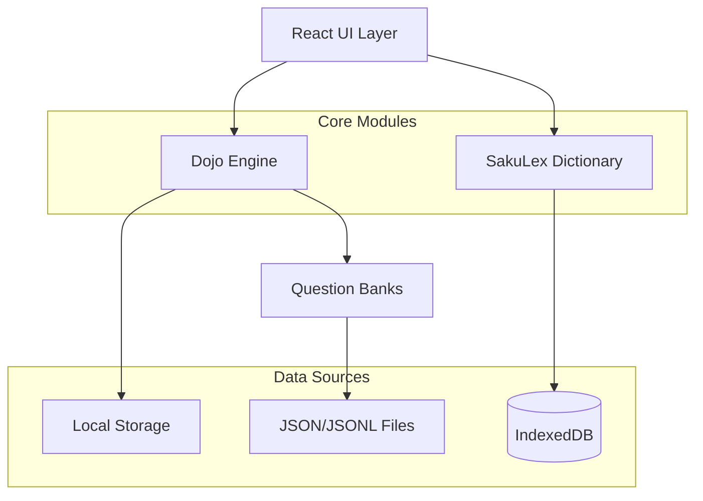

# Design Document

## Overview

Saku Dojo v2 is a React-based single-page application for language learning that supports English and Japanese through structured curricula. The application follows a modular architecture with clear separation between UI components, data management, and business logic. The design emphasizes performance, offline capability, and extensibility while maintaining a clean user experience.

## Architecture

### High-Level Architecture



### Component Architecture

The application follows a single-file React component approach initially, with planned modularization:

1. **Main Component (SakuBilingualDojo)**: Central state management and UI orchestration
2. **Dojo Engine**: Question management, session handling, and progress tracking
3. **SakuLex Module**: Dictionary lookup and linguistic data management
4. **Question Banks**: Structured question data organized by track/curriculum/level
5. **Storage Layer**: localStorage for progress, IndexedDB for dictionary data

## Components and Interfaces

### Core Types

```typescript
// Track and Curriculum Types
type Track = "EN" | "JP";
type Framework = "Classic" | "CEFR" | "JLPT";
type Mode = "Quiz" | "Study" | "Exam" | "Read" | "Write";

// Question Types
interface MCQ {
  id: string;
  type: "mcq";
  prompt: string;
  choices: string[];
  answerIndex: number;
  explanation?: string;
  note?: string;
}

interface Typing {
  id: string;
  type: "typing";
  prompt: string;
  accept: string[];
  placeholder?: string;
  explanation?: string;
}

interface Open {
  id: string;
  type: "open";
  prompt: string;
  explanation?: string;
  rubric?: string[];
}

type Question = MCQ | Typing | Open;

// Progress Tracking
interface ProgressEntry {
  date: string;
  track: Track;
  framework: Framework;
  level: string;
  scorePct: number;
  total: number;
  correct: number;
  mode: Mode;
}

// SakuLex Dictionary
interface Lexeme {
  lang: "en" | "ja";
  lemma: string;
  reading?: string;
  kana?: string;
  kanji?: string;
  pos?: string[];
  senses: { gloss: string; source?: string }[];
  examples?: {
    text: string;
    translation?: string;
    source?: string;
    attribution?: string;
  }[];
  frequency?: { zipf?: number; source?: string };
  forms?: string[];
}
```

### Dojo Engine Interface

```typescript
interface DojoEngine {
  // Session Management
  startSession(track: Track, framework: Framework, level: string, mode: Mode): void;
  getCurrentQuestion(): Question | null;
  getSessionProgress(): { current: number; total: number; correct: number };
  
  // Answer Processing
  answerMCQ(choiceIndex: number): boolean;
  answerTyping(input: string): boolean;
  answerOpen(input: string): void;
  
  // Navigation
  nextQuestion(): void;
  previousQuestion(): void;
  skipQuestion(): void;
  
  // Session Control
  finishSession(): ProgressEntry;
  resetSession(): void;
}
```

### SakuLex Interface

```typescript
interface SakuLex {
  // Dictionary Operations
  lookup(lang: "en" | "ja", lemma: string): Lexeme | undefined;
  search(lang: "en" | "ja", query: string, limit?: number): Lexeme[];
  
  // Data Management
  loadDictionary(lang: "en" | "ja"): Promise<void>;
  isLoaded(lang: "en" | "ja"): boolean;
  
  // Utility Functions
  normalize(text: string): string;
  tokenize(text: string, lang: "en" | "ja"): string[];
}
```

## Data Models

### Question Bank Structure

Questions are organized hierarchically by Track → Framework → Level:

```
BANK: {
  EN: {
    Classic: {
      Beginner: Question[],
      Intermediate: Question[],
      Advanced: Question[],
      Expert: Question[]
    },
    CEFR: {
      A1: Question[],
      A2: Question[],
      B1: Question[],
      B2: Question[],
      C1: Question[],
      C2: Question[]
    }
  },
  JP: {
    Classic: {
      Beginner: Question[],
      Intermediate: Question[],
      Advanced: Question[],
      Expert: Question[]
    },
    JLPT: {
      N5: Question[],
      N4: Question[],
      N3: Question[],
      N2: Question[],
      N1: Question[]
    }
  }
}
```

### Custom Question Tagging

Custom questions include metadata for filtering:

```typescript
interface CustomQuestion extends Question {
  _track: Track;
  _framework: Framework;
  _level: string;
  _created: string;
  _author?: string;
}
```

### Progress Data Structure

```typescript
interface UserProgress {
  entries: ProgressEntry[];
  customQuestions: CustomQuestion[];
  preferences: {
    defaultTrack: Track;
    defaultFramework: Framework;
    defaultLevel: string;
    enableDictionary: boolean;
    enableCustomQuestions: boolean;
  };
  statistics: {
    totalSessions: number;
    totalQuestions: number;
    averageScore: number;
    streakDays: number;
    lastActivity: string;
  };
}
```

## Error Handling

### Error Categories

1. **Data Loading Errors**: Failed to load question banks or dictionary data
2. **Storage Errors**: localStorage/IndexedDB unavailable or corrupted
3. **Session Errors**: Invalid state transitions or corrupted session data
4. **Network Errors**: Failed to fetch external dictionary data
5. **Validation Errors**: Invalid custom question data or malformed input

### Error Handling Strategy

```typescript
interface ErrorHandler {
  handleDataLoadError(error: Error, source: string): void;
  handleStorageError(error: Error, operation: string): void;
  handleSessionError(error: Error, context: string): void;
  handleNetworkError(error: Error, resource: string): void;
  handleValidationError(error: Error, field: string): void;
}

// Error Recovery Mechanisms
class ErrorRecovery {
  // Graceful degradation for missing question banks
  fallbackToDefaultBank(track: Track, framework: Framework): Question[];
  
  // Storage fallback when localStorage unavailable
  useMemoryStorage(): void;
  
  // Dictionary fallback when SakuLex unavailable
  disableDictionaryFeatures(): void;
  
  // Session recovery from corrupted state
  resetToSafeState(): void;
}
```

## Testing Strategy

### Unit Testing

1. **Utility Functions**: Text normalization, shuffling, scoring algorithms
2. **Question Processing**: Answer validation, scoring logic, session management
3. **Data Management**: Storage operations, data serialization/deserialization
4. **Dictionary Operations**: Lookup functions, search algorithms, data parsing

### Integration Testing

1. **Session Flow**: Complete quiz/study/exam workflows
2. **Data Persistence**: Save/load operations across browser sessions
3. **Custom Questions**: Creation, tagging, and integration with existing banks
4. **Progress Tracking**: Score calculation and historical data management

### End-to-End Testing

1. **User Workflows**: Complete learning sessions from start to finish
2. **Cross-Browser Compatibility**: localStorage and IndexedDB behavior
3. **Performance Testing**: Large question banks and dictionary data
4. **Accessibility Testing**: Keyboard navigation and screen reader support

### Test Data Strategy

```typescript
// Mock question banks for testing
const TEST_BANKS = {
  EN: {
    Classic: {
      Beginner: [
        // Minimal test questions
      ]
    }
  }
};

// Mock dictionary data
const TEST_LEXEMES = [
  {
    lang: "en",
    lemma: "test",
    senses: [{ gloss: "a procedure for critical evaluation" }]
  }
];

// Test utilities
class TestUtils {
  createMockSession(track: Track, framework: Framework, level: string): DojoSession;
  generateTestQuestions(count: number, type: "mcq" | "typing"): Question[];
  mockLocalStorage(): void;
  mockIndexedDB(): void;
}
```

## Performance Considerations

### Bundle Size Optimization

1. **Code Splitting**: Separate dictionary data from main bundle
2. **Lazy Loading**: Load question banks on demand
3. **Tree Shaking**: Remove unused framework levels and question types
4. **Compression**: Gzip/Brotli compression for static assets

### Runtime Performance

1. **Virtual Scrolling**: For large question lists and progress history
2. **Memoization**: Cache expensive calculations (progress statistics, search results)
3. **Debouncing**: Dictionary lookups and search operations
4. **Web Workers**: Background processing for large dictionary operations

### Storage Optimization

```typescript
// Efficient storage strategies
class StorageOptimizer {
  // Compress progress data
  compressProgressData(entries: ProgressEntry[]): string;
  
  // Implement LRU cache for dictionary lookups
  createDictionaryCache(maxSize: number): LRUCache<string, Lexeme>;
  
  // Batch storage operations
  batchStorageWrites(operations: StorageOperation[]): Promise<void>;
  
  // Clean up old data
  cleanupOldProgress(retentionDays: number): void;
}
```

## Security and Privacy

### Data Privacy

1. **Local-First**: All user data stored locally, no external transmission
2. **Data Minimization**: Only collect necessary progress and preference data
3. **User Control**: Export/import functionality for data portability
4. **Clear Attribution**: Transparent licensing for all content sources

### Content Security

1. **Input Sanitization**: Validate all user-generated content (custom questions)
2. **XSS Prevention**: Sanitize HTML content in questions and explanations
3. **Content Validation**: Verify question format and required fields
4. **Safe Defaults**: Fallback to safe content when validation fails

## Accessibility

### WCAG 2.1 Compliance

1. **Keyboard Navigation**: Full functionality without mouse
2. **Screen Reader Support**: Proper ARIA labels and semantic HTML
3. **Color Contrast**: Meet AA standards for all text and UI elements
4. **Focus Management**: Clear focus indicators and logical tab order

### Internationalization

1. **RTL Support**: Prepare for Arabic/Hebrew language additions
2. **Font Loading**: Proper fallbacks for Japanese characters
3. **Input Methods**: Support for IME and special character input
4. **Cultural Adaptation**: Appropriate examples and cultural references

## Deployment and Distribution

### Build Process

```typescript
// Build configuration
interface BuildConfig {
  target: "development" | "production";
  enableDictionary: boolean;
  includedTracks: Track[];
  includedFrameworks: Framework[];
  bundleSize: {
    maxMainBundle: number; // 200KB
    maxDictionaryBundle: number; // 2MB per language
  };
}
```

### Distribution Strategy

1. **Static Hosting**: Deploy as static files to CDN
2. **Progressive Web App**: Service worker for offline functionality
3. **Version Management**: Semantic versioning with migration strategies
4. **Feature Flags**: Runtime configuration for experimental features

### Monitoring and Analytics

```typescript
// Privacy-respecting analytics
interface Analytics {
  // Learning effectiveness metrics
  trackSessionCompletion(mode: Mode, duration: number, score: number): void;
  trackLevelProgression(track: Track, framework: Framework, from: string, to: string): void;
  trackFeatureUsage(feature: string, context: string): void;
  
  // Performance metrics
  trackLoadTime(component: string, duration: number): void;
  trackErrorRate(errorType: string, frequency: number): void;
  
  // User engagement (anonymous)
  trackRetention(daysSinceFirstUse: number): void;
  trackSessionFrequency(sessionsPerWeek: number): void;
}
```